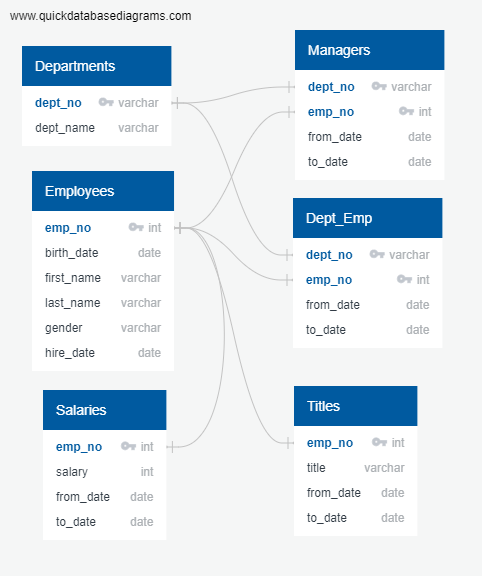

# Pewlett-Hackard-Analysis

## Overview of Project
## Resources 
* Data Sources: departments.csv, dept_managers.csv, dept_emp.csv, employees.csv, salaries.csv, titles.csv
* SQL, PostgreSQL, pgAdmin 4
## Results
The ERD pictured was created to help visualize the relationship between data sources. 

### Future Job Openings
### Mentoriship Progroam Eligability
## Summary
