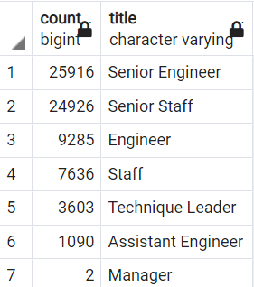
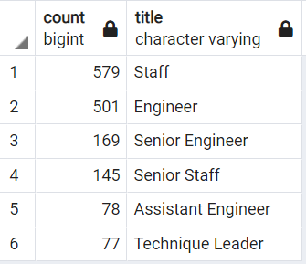
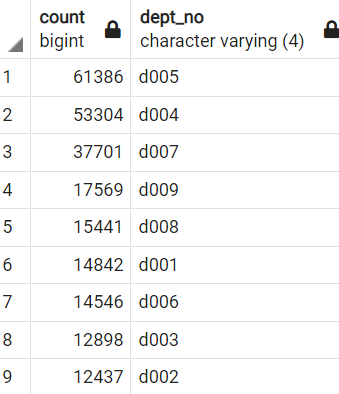

# Pewlett-Hackard-Analysis

## Overview of Project
The purpose of this project is to help Pewlett Hackard identify which employees will be retiring soon to prepare for the upcoming job vacancies.
## Resources 
* Data Sources: departments.csv, dept_managers.csv, dept_emp.csv, employees.csv, salaries.csv, titles.csv
* SQL, PostgreSQL, pgAdmin 4
## Results
The ERD pictured was created to help visualize the relationship between data sources. 

### Future Job Openings
After joining together our data tables, removing duplicate entries due to promotions, and filtering only for those who are currently employed (to_date =9999-01-01), it was evident that there are currently over 70,000 employees of retiring age. 
Of those of retirement age, we can see about 70% hold senior titles such as Senior Engineer or Senior Staff.

### Mentoriship Program Eligability
We are considering employees born between 1952 and 1955 as retiring age, and employees born in 1965 as good candidates for a mentorship program.
By using the same counting code used to gather information on count by titles of retiring employees, I was also able to gather information on counts by mentorship eligible employees by their titles.

With majority of titles being non-senior level, these employees would benefit the most from mentoring with soon-to-be retiring senior staff to better prepare Pewlett Hackard for their loss in staff.

## Summary
### How many roles will need to be filled as the "silver tsunami" begins to make an impact?
In total, there are about 72,000 roles opening in the near future with over 70% of those being senior staff. With only about 1500 employees eligible for the mentorship program, I would recommend extending timeframe eligibility from just 1965 to 1964-1966. This will allow more than triple the amount of eligible employees to learn from senior staff before they retire.
### Are there enough qualified, retirement-ready employees in the departments to mentor the next generation of Pewlett Hackard employees?
By greating additional table "department_retirement" I was able to get the count of retiring employees by their department:

From here, we can gather that departments 4 and 5 are going to need the most support to survive the "silver tsunami" and Pewlett Hackard should heighten their efforts there.
